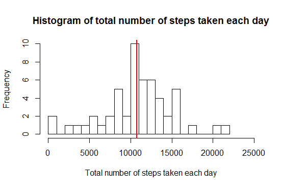
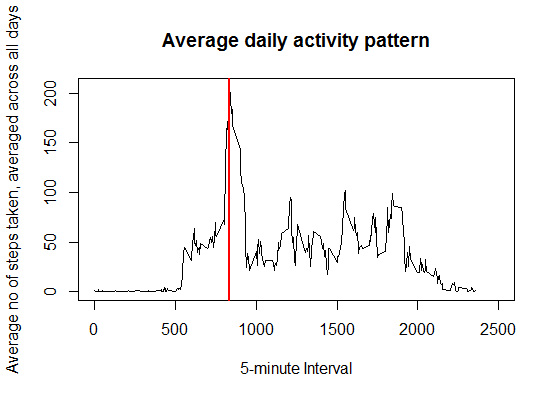
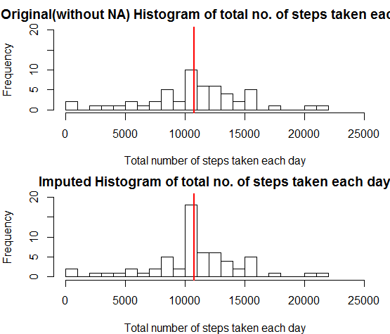
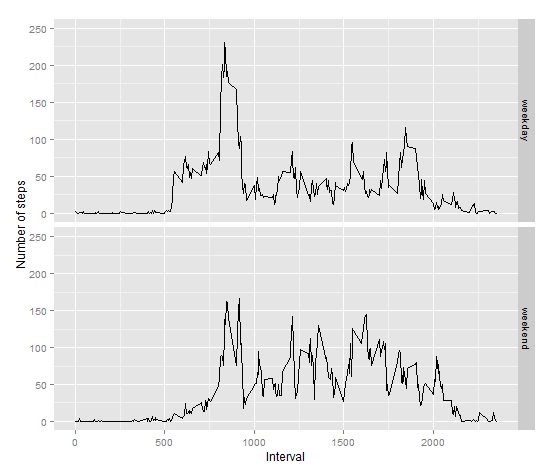

# Reproducible Research: Peer Assessment 1


## Loading and preprocessing the data


```r
# Download the activity.zip file from provided path in the working directory
download.file(url="https://d396qusza40orc.cloudfront.net/repdata%2Fdata%2Factivity.zip", 
destfile=paste(getwd(),"/activity.zip",sep=""))
# Unzip the activity.csv file from the zip file in the working directory
unzip(paste(getwd(),"/activity.zip",sep=""), files=c("activity.csv"), list=FALSE,overwrite=TRUE)
# Load the data using read.csv
activity <- read.csv(paste(getwd(),"/activity.csv",sep=""), header=TRUE)
# Eliminate observations that contain NA in any variable
activity1 <- na.omit(activity)
```

Total no of rows in the original dataset(activity) is **17568**

Total no of rows without missing values(NA) in the data set(activity1) is **15264**

There are **8** dates with missing values(NA) for the variable, steps at all intervals(0 to 2355). The dates are :  **2012-10-01, 2012-10-08, 2012-11-01, 2012-11-04, 2012-11-09, 2012-11-10, 2012-11-14, 2012-11-30**


## What is mean total number of steps taken per day?


```r
# Calculate the total number of steps taken per day
activity2 <- with(activity1, aggregate(steps,by=list(date=date), sum))
# Plot the histogram of total number of steps taken each day
hist(activity2$x, breaks=20, xlim=c(0, 25000), plot=TRUE, 
     xlab="Total number of steps taken each day", 
     main="Histogram of total number of steps taken each day")
# Add the mean vertical line(red)
abline(v = as.integer(mean(activity2$x)), col = "red", lwd = 2)
```

 

Mean of the total number of steps taken per day( shown as a red vertical line in the histogram above): **10766**

Median of the total number of steps taken per day: **10765**


## What is the average daily activity pattern?


```r
# Calculate the mean of the total number of steps taken per interval
activity3 <- with(activity1, aggregate(steps,by=list(interval=interval), mean))
# Add a variable,meansteps to store the rounded value of the steps per interval
activity3$meansteps <- round(activity3$x)
# Make a time series plot (i.e. type = "l") of the 5-minute interval (x-axis) and the average number of steps 
# taken, averaged across all days (y-axis)
plot(activity3$interval, activity3$x, type="l", xlim=c(0,2500), xlab="5-minute Interval",
     ylab="Average no of steps taken, averaged across all days", 
     main="Average daily activity pattern")
# Add the vertical line(red) indicating maximum number of steps in a 5-minute interval, on average across all 
# the days in the dataset,
abline(v = activity3[activity3$x == max(activity3$x), ]$interval, col = "red", lwd = 2)
```

 

The 5-minute interval, **835**  on average across all the days in the dataset, contains the maximum number of steps(  shown as a red vertical line in the plot above)


## Imputing missing values

### Strategy: Impute the missing values with mean of valid values for that  interval.

Total number of missing values(NA) in the original dataset is: **2304**


```r
suppressWarnings(suppressMessages(library("knitr")))
if (!require("plyr")) {
suppressWarnings(suppressMessages(install.packages("plyr")))
}
suppressWarnings(suppressMessages(library("plyr")))

if (!require("Hmisc")) {
    suppressWarnings(suppressMessages(install.packages("Hmisc")))
}
suppressWarnings(suppressMessages(library("Hmisc")))

# Create a new variable, UpdatedSteps replicating steps to contain the mean of the valid values for that 
# interval
activity$UpdatedSteps <- activity$steps

# Replace the missing values per interval with imputed values as the mean of the valid values per interval  
for (cnt in (activity3$interval))
{
    activityTemp <- activity[activity$interval==cnt, ]
    activityTemp$UpdatedSteps <- impute(activityTemp$UpdatedSteps, activity3[activity3$interval==cnt, "x"])
    if (cnt == 0)
    {
        activityFinal <- activityTemp
    }
    else
    {    
        activityFinal <- rbind(activityFinal, activityTemp)
    }
}
# Sort the new activity dataset by date and interval(similar to original dataset)
activityFinal <- arrange(activityFinal, date, interval)

# Calculate the total number of steps taken per day with imputed values in the dataset 
activity4 <- with(activityFinal, aggregate(UpdatedSteps,by=list(date=date), sum))

par(mfrow = c(2, 1), mar = c(4, 4, 2, 1))
{
#     Original histogram with missing values
    hist(activity2$x, breaks=20, xlim=c(0, 25000), ylim=c(0, 20), plot=TRUE, 
     xlab="Total number of steps taken each day", 
     main="Original(without NA) Histogram of total no. of steps taken each day")
    abline(v = as.integer(mean(activity2$x)), col = "red", lwd = 2)

#     Imputed values histogram
    hist(activity4$x, breaks=20, xlim=c(0, 25000), ylim=c(0, 20), plot=TRUE, 
     xlab="Total number of steps taken each day", 
     main="Imputed Histogram of total no. of steps taken each day")
    abline(v = as.integer(mean(activity4$x)), col = "red", lwd = 2)
}
```

 

Mean of the total number of steps taken per day( shown as a red vertical line in the histogram above): **10766**

Median of the total number of steps taken per day: **10766**

**Do these values differ from the estimates from the first part of the assignment?**

The estimates are similar in terms of the mean and median values of the total number of steps taken per day being almost the same. The mean is 1 step higher in the imputed data. The medians are similar.

**What is the impact of imputing missing data on the estimates of the total daily number of steps?**

There are **86129** additonal steps as a result of imputing the missing data. There are **10766** steps for missing step values for the  dates, **2012-10-01, 2012-10-08, 2012-11-01, 2012-11-04, 2012-11-09, 2012-11-10, 2012-11-14, 2012-11-30**


## Are there differences in activity patterns between weekdays and weekends?


```r
# Transform variable date to new variable, date1 to be of type, Date 
activityFinal <- transform(activityFinal, date1=as.Date(activityFinal$date, format="%Y-%m-%d",tz=""))

# Create a new factor variable in the dataset with two levels - "weekday" and "weekend" indicating 
# whether a given date is a weekday or weekend day.
activityFinal <- cbind(activityFinal,daytype = ifelse((weekdays(activityFinal$date1,abbreviate=TRUE)
=="Sat") | (weekdays(activityFinal$date1, abbreviate=TRUE) == "Sun"), "weekend","weekday"))

# Calculate the average total number of steps taken per weekday/weekend day for each interval
activity5 <- with(activityFinal, aggregate(UpdatedSteps,by=list(interval=interval,
daytype=daytype), mean))

# Make a panel plot using ggplot containing a time series plot(i.e.type="l") of the 5-minute interval 
# (x-axis) and the average no. of steps taken, averaged across all weekday or weekend days(y-axis).
g <- ggplot(activity5, aes(interval, x))
g + geom_line() + facet_grid(daytype ~ .)+labs(x="Interval")+labs(y = "Number of steps")+ylim(0,250)
```

 
